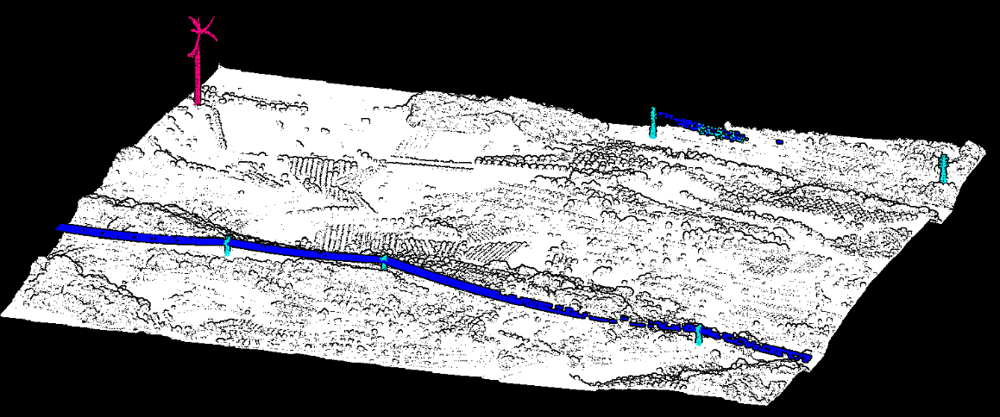
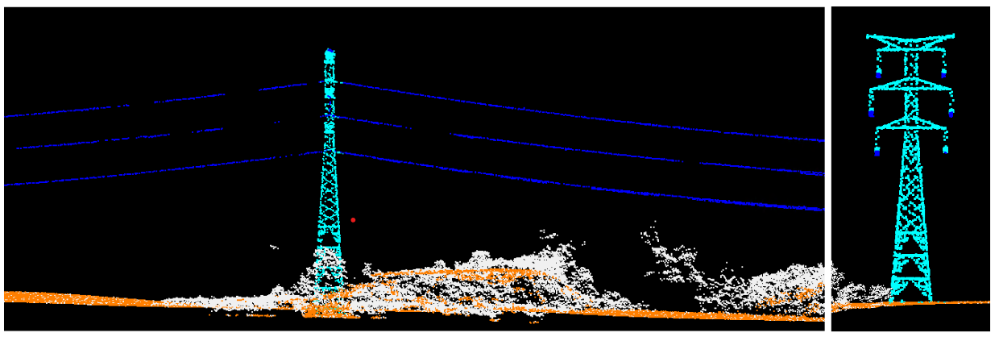

# Strategies for Point Classification in LiDAR Scenes

[](https://www.mdpi.com/2072-4292/16/12/2153)
[](https://opensource.org/licenses/MIT)

Official implementation and trained weights for the study on automated semantic segmentation of ALS (Airborne Laser Scanning) data over complex hilly and forested terrains.

---

## 👨‍🔬 Authors & Affiliations
* **[Mariona Carós](https://www.linkedin.com/in/marionacaros/)** (University of Barcelona & Cartographic Institute of Catalonia)
* **[Santi Seguí](https://ssegui.github.io/)** (University of Barcelona)
* **[Jordi Vitrià](https://algorismes.github.io/)** (University of Barcelona)
* **[Ariadna Just](https://www.linkedin.com/in/ariadna-just-0a667559/)** (Cartographic Institute of Catalonia)

---

## 📖 Abstract
Light Detection and Ranging (LiDAR) systems are essential for 3D environment understanding, yet automation faces challenges like variable point density and extreme class imbalance. In this work, we evaluate deep learning strategies on a custom dataset captured via hybrid ALS sensors (RGB + NIR) over dense forest and hilly topography. Our methodology significantly improves Intersection over Union (IoU) scores compared to baseline methods by optimizing training and inference strategies for varying-sized point clouds.

<details>
<summary><b>Click to read full abstract</b></summary>
Automating point cloud scene segmentation encounters notable challenges due to variable point density, ambiguous object shapes, and substantial class imbalance. Consequently, manual intervention remains prevalent. We conduct empirical evaluations on a self-captured dataset characterized by hilly topography. Our findings emphasize the importance of employing appropriate training and inference strategies to achieve accurate classification across all categories.
</details>

---
## 📖 Key Research Contributions
* **mIoU of 94.24%:** Our methodology yields significant performance improvements over preceding methodologies on our self-captured datasets, such as [TerLiDAR](https://github.com/marionacaros/terlidar)
* **Architecture-Independent Gains:** We demonstrate that training and inference strategies alone are critical for obtaining best results.
* **Uncertainty-Based Inference:** A novel strategy using prediction entropy to improve minority class performance by **+2.9% IoU** while remaining **10x faster** than standard voting strategies.
* **Scalable Pipeline:** Efficiently handles point cloud sizes ranging from $10^3$ to $4\times10^5$ points.

### [cite_start]Per-Class Accuracy [cite: 742]
The following results were achieved using PointNet++ with our **Uncertainty-Based Inference** strategy:

| Class | IoU (%) |
| :--- | :--- |
| **Wind Turbine** | 98.33% |
| **Power Lines** | 95.97% |
| **Tower** | 82.66% |
| **Surrounding** | 99.99% |
| **Global mIoU** | **94.24%** |

### Robustness on Out-of-Domain (OOD) Data
Our model maintains a high **94.33% mIoU** when tested on unfamiliar geographical locations (4 tiles of $1\times1$ km), demonstrating excellent generalization capacity.

---

## 🖼️ Visual Results

### Terrain Segmentation Performance
Comparison of ground truth vs. model predictions on hilly topography.


### Out-of-Distribution (OOD) Robustness
Evaluation of the model's generalization capabilities on unseen scenes.


---

## 📦 Model Weights
The best-performing weights are provided in the repository:
* **Path:** `src/checkpoints/seg_01-23-10:55_weighted.pth`

> [!TIP]
> Use these weights for out-of-the-box inference on TerLiDAR classes or as a backbone for further fine-tuning.

### Citation
If you find this work useful for your research, please cite:
```bibtex
@Article{rs16122153,
AUTHOR = {Carós, Mariona and Just, Ariadna and Seguí, Santi and Vitrià, Jordi},
TITLE = {Effective Strategies for Point Classification in LiDAR Scenes},
JOURNAL = {Remote Sensing},
VOLUME = {16},
YEAR = {2024},
NUMBER = {12},
ARTICLE-NUMBER = {2153},
URL = {[https://www.mdpi.com/2072-4292/16/12/2153](https://www.mdpi.com/2072-4292/16/12/2153)},
DOI = {10.3390/rs16122153}
}
